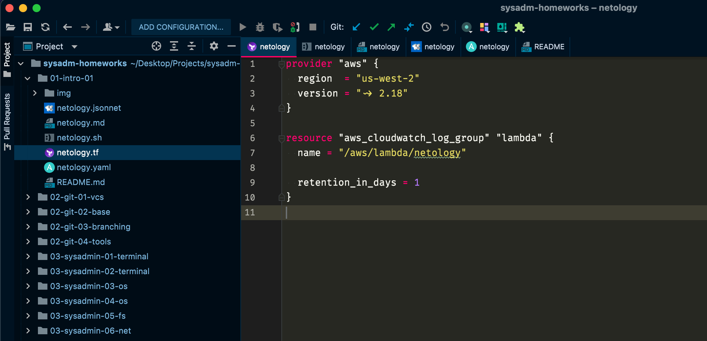
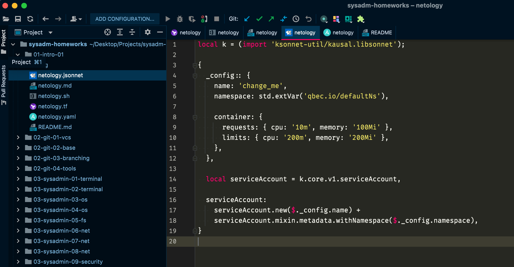

# 1.1 Введение в DevOps (Садовиков Сергей)

## Задание 1. Подготовка рабочей среды

Вы пришли на новое место работы или приобрели новый компьютер.
Первым делом надо настроить окружение для дальнейшей работы. 

1. Установить [Py Charm Community Edition](https://www.jetbrains.com/ru-ru/pycharm/download/) - это бесплатная версия IDE.   
В качестве альтернативы можно установить [Visual Studio Code](https://code.visualstudio.com/Download) и дальнейшие шаги проделать с ним. Таким образом вы сможете выбрать для себя более удобный инструмент.

   Далее для примера будут приведены скриншоты из PyCharm.

2. Установить плагины:
    - Terraform,
    - MarkDown,
    - Yaml/Ansible Support,
    - Jsonnet.
3. Склонировать текущий репозиторий (команда `git clone`) или просто создать файлы для проверки плагинов:
    - [netology.tf](netology.tf) – terraform,
    - [netology.sh](netology.sh) – bash,
    - [netology.md](netology.md) – markdown, 
    - [netology.yaml](netology.yaml) – yaml,
    - [netology.jsonnet](netology.jsonnet) – jsonnet.
4. Убедитесь, что работает подсветка синтаксиса, файлы должны выглядеть вот так:
-

*В качестве выполненного задания приведите скриншоты установленной IDE с плагинами в файле readme.md собственного репозитория в GitHub или в Google Doc*

## Ответ №1 Подготовка рабочей среды

Так как все время работаю в PHPStorm, дополнил среду плагинами в нем, так как он включает в себя функционал PyCharm.

----

## Задание 2. Описание жизненного цикла задачи (разработки нового функционала)

Чтобы лучше понимать предназначение дальнейших инструментов, с которыми нам предстоит работать, давайте 
составим схему жизненного цикла задачи в идеальном для вас случае.

### Описание истории

Представьте, что вы работаете в стартапе, который запустил интернет-магазин. Ваш интернет-магазин достаточно успешно развивался, и вот пришло время налаживать процессы: у вас стало больше конечных клиентов, менеджеров и разработчиков.Сейчас от клиентов вам приходят задачи, связанные с разработкой нового функционала. Задач много, и все они требуют выкладки на тестовые среды, одобрения тестировщика, проверки менеджером перед показом клиенту. В случае необходимости, вам будет необходим откат изменений. 

### Решение задачи

Вам необходимо описать процесс решения задачи в соответствии с жизненным циклом разработки программного обеспечения. Использование какого-либо конкретного метода разработки не обязательно. Для решения главное - прописать по пунктам шаги решения задачи (релизации в конечный результат) с участием менеджера, разработчика (или команды разработчиков), тестировщика (или команды тестировщиков) и себя как DevOps-инженера. 

## Ответ №2 

