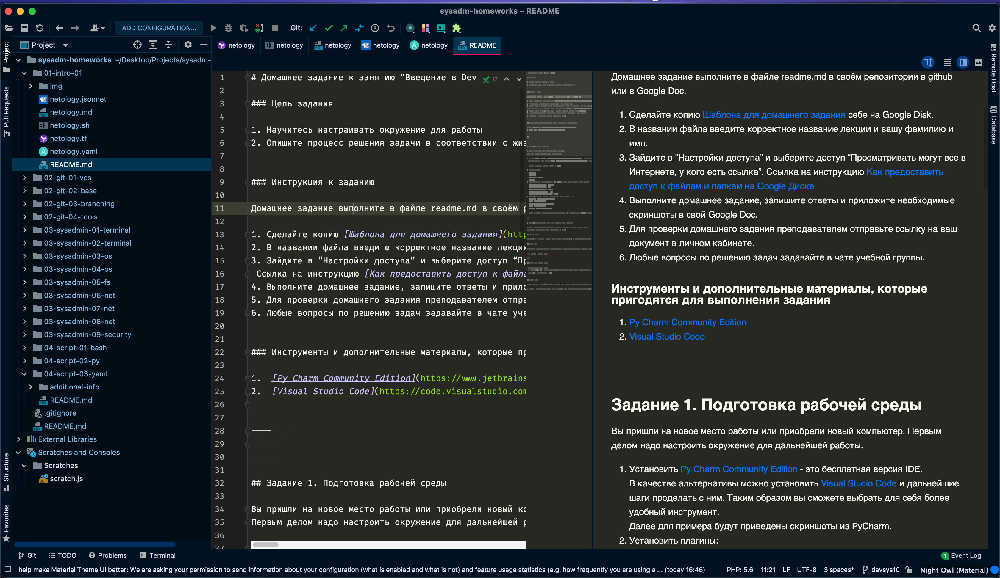
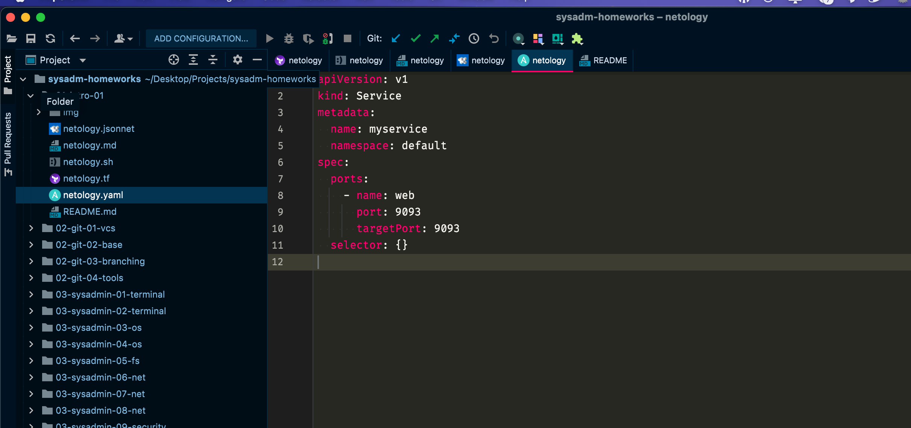
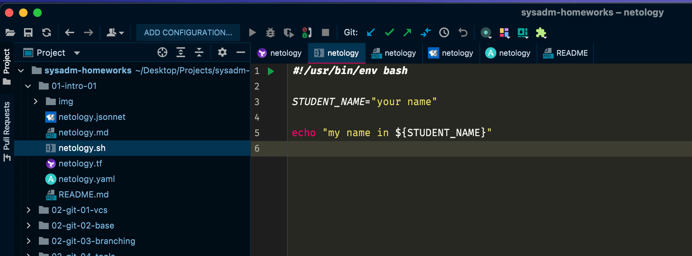

# 1.1 Введение в DevOps (Садовиков Сергей)

## Задание 1. Подготовка рабочей среды

Вы пришли на новое место работы или приобрели новый компьютер.
Первым делом надо настроить окружение для дальнейшей работы. 

1. Установить [Py Charm Community Edition](https://www.jetbrains.com/ru-ru/pycharm/download/) - это бесплатная версия IDE.   
В качестве альтернативы можно установить [Visual Studio Code](https://code.visualstudio.com/Download) и дальнейшие шаги проделать с ним. Таким образом вы сможете выбрать для себя более удобный инструмент.

   Далее для примера будут приведены скриншоты из PyCharm.

2. Установить плагины:
    - Terraform,
    - MarkDown,
    - Yaml/Ansible Support,
    - Jsonnet.
3. Склонировать текущий репозиторий (команда `git clone`) или просто создать файлы для проверки плагинов:
    - [netology.tf](netology.tf) – terraform,
    - [netology.sh](netology.sh) – bash,
    - [netology.md](netology.md) – markdown, 
    - [netology.yaml](netology.yaml) – yaml,
    - [netology.jsonnet](netology.jsonnet) – jsonnet.
4. Убедитесь, что работает подсветка синтаксиса, файлы должны выглядеть вот так:
-

*В качестве выполненного задания приведите скриншоты установленной IDE с плагинами в файле readme.md собственного репозитория в GitHub или в Google Doc*

## Ответ №1 Подготовка рабочей среды

Так как все время работаю в PHPStorm, дополнил среду плагинами в нем, так как он включает в себя функционал PyCharm.

----

## Задание 2. Описание жизненного цикла задачи (разработки нового функционала)

Чтобы лучше понимать предназначение дальнейших инструментов, с которыми нам предстоит работать, давайте 
составим схему жизненного цикла задачи в идеальном для вас случае.

### Описание истории

Представьте, что вы работаете в стартапе, который запустил интернет-магазин. Ваш интернет-магазин достаточно успешно развивался, и вот пришло время налаживать процессы: у вас стало больше конечных клиентов, менеджеров и разработчиков.Сейчас от клиентов вам приходят задачи, связанные с разработкой нового функционала. Задач много, и все они требуют выкладки на тестовые среды, одобрения тестировщика, проверки менеджером перед показом клиенту. В случае необходимости, вам будет необходим откат изменений. 

### Решение задачи

Вам необходимо описать процесс решения задачи в соответствии с жизненным циклом разработки программного обеспечения. Использование какого-либо конкретного метода разработки не обязательно. Для решения главное - прописать по пунктам шаги решения задачи (релизации в конечный результат) с участием менеджера, разработчика (или команды разработчиков), тестировщика (или команды тестировщиков) и себя как DevOps-инженера. 

## Ответ №2 

Жизненнный цикл задачи в разных проектах может выстраиваться по разному, часто это зависит от большого количества факторов. Специфики бизнеса, зрелости и объема команды, текущих обстоятельств, бюджета и так далее. Постараюсь описать процесс в более-менее идеальном варианте. 

Разберем ситуацию, когда инициатива задачи на стороне бизнеса. 
- Задача попадает на Product Owner'a или Бизнес Аналитика, который прорабатывает гипотезы и иные факторы. Результатом этапа являются сформированные бизнес-требования.
- Далее задача передается в Системную аналитику, где формируется технические требования к задаче, задача в таск-трекере, документация. Результатом этапа является готовая задача в таск-трекере с документацией, критериями приемке, задача попадает в backlog.
- По SCRUM фреймворку проводится грумминг задач и планирование спринта. Этот этап проводится с участием Product Owner'а, Project Manager'a (хоть его и нет по Scrum'у) и Teamlead'ом. Результатом этапа является передвижение задачи в спринт и распределена на разработчика. 
- Задача выполняется в рабочем порядке разработчиком, на своей развернутой песочнице, создается ветка, отбранчованная от master-ветки и переходит на этап тестирования
- Задача проходит тестирование QA-специалистом, задача тестируется на отдельном стенде тестирования, изолированно. Пишутся тест кейсы. Если задача не соответствует требованиям, задача уходит обратно в Todo. Положительным результатом является переход задачи в статус "К деплою". 

### Далее зависит от воркфлоу команды. 

- Формируется список задач к деплою. Предположим, что деплой происходит раз в неделю, по средам. Тимлид собирает релизную ветку, содержащую все задачи для релиза. 
- Релизная ветка раскатывается на стейдж-стенде, который максимально приближен к продакшену. (Делается это либо Тимлидом, либо Девопсом). 
- Релиз тестируется, проходится критроуд. Релиз проверяется автотестами  (делается это QA-специалистами)
- После того, как релиз протестирован, релиз деплоится на продакшен (Делается это либо Тимлидом, либо DevOps'ом). 

### Какое участие DevOps'а в этой цепочке:
- Обеспечение команду разработки песочницами, стендами тестирования, стейджа, которые максимально приближены к продакшену. 
- Обеспечение скриптами деплоя и удобными скриптами раскатки гитовых веток для облегчения тестирования
- Обеспечение CD (Continious Delivery) на стенды
- Создание отдельного общего стенда тестирования, на который автоматически поступают задачи из develop-ветки
- Обеспечение и поддержка инфраструктуры проекта, кластеров, мониторинг нагрузки, реализация ПО для мониторинга нагрузки, ошибок, и отказаустойчивости. 
- Обеспечение безопасности серверов и инфраструктуры. 
- Реализация резервного копирования проекта, БД, репозиториев и т. д. 

